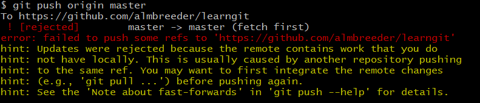

## git的一些常用命令
查看当前Git环境所有配置
```bash
git config --list
```

```bash
git config --global user.name "xxx"
git config --global user.email "xxx"
```
**Tips: 使用utf-8 Rom写文件**

添加文件
```bash
git add filename
git add filename1
```
删除文件
```bash
git rm <file>
```
提交更改
```bash
git commit -m "description"
```
查看状态
```bash
git status
```
查看提交记录
```bash
git log 
```
查看命令历史
```bash
git reflog
```
回滚版本上一个版本
```bash
git reset --hard HEAD^
git reset --hard HEAD~1
```
回滚到指定版本
```bash
git reset --hard commit_id
```
丢弃工作区的修改
```bash
git restore -- file
```

### 连接远程库

https://blog.csdn.net/u013778905/article/details/83501204

```bash
git remote add origin git@xxxx
git push -u origin master
```
后续推送
```bash
$ git push origin master
```
### 代码合并

```bash
git pull --rebase origin master
```